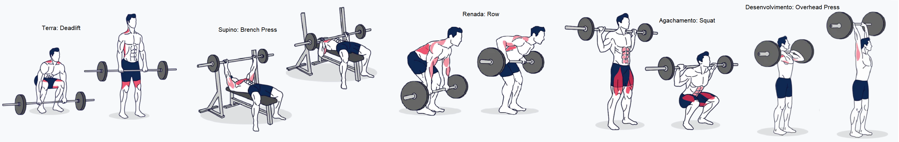

# Exercise Monitor

## Introduction
The lack of focus on strength training programs in related literature and the absence of support from current activity trackers for free weight exercises are challenges faced by many fitness enthusiasts and professionals. With the growing interest in activity monitoring technologies and applications, there is significant potential for developing solutions that can help bridge this gap. Additionally, activity recognition can be employed to address significant societal challenges such as rehabilitation, sustainability, elderly care, and health. In this project, I propose exploring the possibilities of context-aware applications in the field of strength training, utilizing data collected from wrist sensors (smartwatches) to analyze free weight exercises. The goal is to develop models that, like personal trainers, monitor exercises, count repetitions, identify exercises, and detect improper execution forms to assist users in achieving their goals more efficiently and safely.

## Exercises

## Objectives
* Classify basic barbell exercises
* Count the number of repetitions
* Detect improper movement

## Installation
Create, install, and activate the Anaconda environment: `conda env create -f environment.yml`.

---

## Step 01 - Data Preparation
Read all the separate raw CSV files, process them, and merge them into a single dataset.

1. Dataset located at → data/raw
2. Extract features from file name
3. Read all files
4. Work with datetimes
5. Create a custom function
6. Merge datasets
7. Resample data (frequency conversion)
8. Export processed dataset

Original code: `make_dataset.py`

Explained step-by-step: `01_make_dataset.ipynb`

---

## Step 02 - Exploratory Data Analysis (EDA)
Create scripts to process, visualize, and model accelerometer and gyroscope data.
1. Plot time series for all exercises
2. Plot all axes (x, y, and z)
3. Compare participants
4. Create a loop to plot all sensor combinations
5. Combine plots into a single figure
6. Loop through all combinations and export for both sensors

Original code: `visualize.py`

Explained step-by-step: `02_visualize.ipynb`

---

## Step 03 - Handling Outliers
Check for any outliers in the data that need to be removed.

1. Box plots and interquartile range (IQR)
2. Plotting outliers over time
3. Function to mark outliers using various methods (IQR, Chauvenet's Criterion, Local Outlier Factor)
4. Checking outliers grouped by label
5. Replacing outliers

Original code: `remove_outliers.py`

Explained step-by-step: `03_remove_outliers.ipynb`

---

## Step 04 - Feature Engineering
Filter noise and identify parts of the data that explain most of the variance using PCA. Then, add numerical, temporal, frequency, and clustering features to generate new features.

1. Handling missing values
2. Lowpass filter (Butterworth)
3. Applying PCA
4. Square root of sum of squares (vector r)
5. Temporal abstraction
6. Frequency abstraction
7. Handling overlapping data (overfitting)

Original code: `build_features.py`

Explained step-by-step: `04_build_features.ipynb`

---

## Step 05 - Training the Model
Conduct experiments for feature selection, model choice, and hyperparameter tuning to find the combination that results in the highest accuracy for exercise classification.

1. Creating training and test sets
2. Splitting feature subsets
3. Forward feature selection using simple decision tree
4. Applying multiple models and grid search for hyperparameter tuning
5. Comparing results
6. Selecting the best model and evaluating results
7. Testing a simpler model

Original code: `train_model.py`

Explained step-by-step: `05_train_model.ipynb`

---

## Step 06 - Counting Repetitions
Create a Python script that can count repetitions and measure code efficiency.

1. Visualize data to identify patterns
2. Configure LowPassFilter (Butterworth)
3. Create a function to count repetitions
4. Create a benchmark dataframe
5. Evaluate the results (MAE)

Original code: `count_repetitions.py`

Explained step-by-step: `06_count_repetitions.ipynb`
